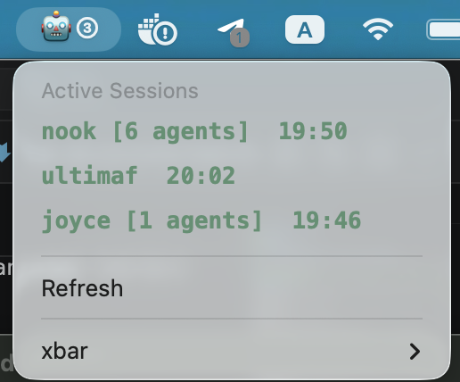

# csessions

xbar plugin to monitor active Claude Code sessions from the macOS menu bar.

## Install

1. Install [xbar](https://xbarapp.com)
2. Copy `claude-sessions.5m.sh` to `~/Library/Application Support/xbar/plugins/`
3. Make it executable: `chmod +x ~/Library/Application\ Support/xbar/plugins/claude-sessions.5m.sh`
4. Refresh xbar

## Requirements

- macOS
- Python 3
- Claude Code
